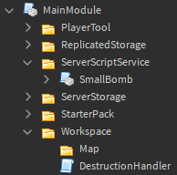

# Waviest's Module Unpacker

 

Instead of painfully adding multiple lines of code to clone and move everything into ReplicatedStorage or ServerScriptService, you can use this ModuleScript to unpack contents into their respective locations without the hassle of needing to do it yourself

# Small documentation/notes

- Creating a folder called "`PlayerTool`", it will automatically drop any tools in there into the user you specify upon unpacking
- To unpack, use this command as a base, `require(<id: int>).unpack("<your username: str>")`

Credit me if you use it and if you modify to be better, feel free to create a PR to make the module better for everyone
